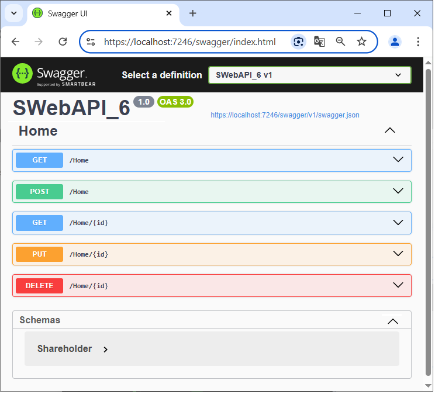

# RESTful API - Sample Console WebAPI in .NET 8

## Overview
This application is a **minimal RESTful Web API** built with .NET 8. It demonstrates how to build a fully functional REST API **without using a database** — instead, it works on an in-memory `List<Shareholder>`.

Swagger (via Swashbuckle) is included to explore and test theendpoints.

---

## What is a RESTful API?

A **RESTful API** (Representational State Transfer) is a standard for designing web services that:

* Uses **HTTP methods** (GET, POST, PUT, DELETE)
* Operates with **stateless** requests
* Organizes endpoints around **resources**, not actions
* Returns **standard HTTP status codes** (200 OK, 404 Not Found, etc.)

In this project:

* The controller is mapped to the `[controller]` route
* All four main HTTP verbs are implemented
* JSON is used as the standard data format

---

## Project Structure

### 1. `Program.cs`

* Configures and starts the Web API
* Registers Swagger
* Maps controllers

### 2. `Controllers/HomeController.cs`

Implements a RESTful API for managing `Shareholder` objects.

**Supported Endpoints:**

* `GET /home` → Get all shareholders
* `GET /home/{id}` → Get a shareholder by ID
* `POST /home` → Add a new shareholder
* `PUT /home/{id}` → Update an existing shareholder
* `DELETE /home/{id}` → Delete a shareholder

Uses a hardcoded JSON string to load initial sample data.

### 3. `Models/Shareholder.cs`

Defines the `Shareholder` data model with validation attributes:

* `Id`, `FirstName`, `LastName`, `Sex`, `Address`, `City`, `Shares`, `JoinDate`

---

## Testing client/server actions via Swagger

The application's operation was tested on the popular Swagger 
program. Below are a few views of testing.

 

 

 

 
 
---

## ✅ Summary

This project is a **clean and educational example** of a RESTful API:

* No external database
* Simple in-memory list
* Clear routing and controller actions
* Integrated Swagger UI for testing

A great base for learning or extending into a more complex API later.

---
